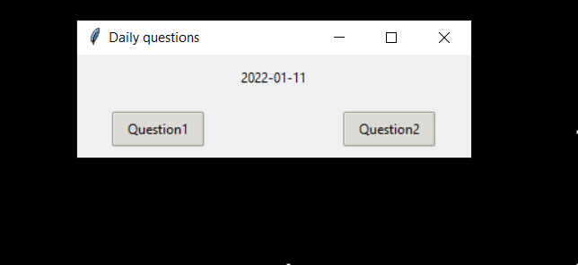

# Interval Learning Flashcards

> A Python application that asks you 2 random questions per day.
> 
> Based on the Leitner system, newly introduced and more difficult questions are shown more frequently,
> while older and less difficult ones are shown less frequently in 
> order to exploit the psychological spacing effect.

## Installation (Windows)
git clone the project

## Usage example
### Get started
For the first time you will use this app, you need to 

## Release History
* 0.0.1
    * First realease

## Meta

LABESSE Maxence - maxence.labesse@yahoo.fr

Distributed under the MIT license. See ``LICENSE`` for more information.

[https://github.com/Maxence-Labesse/Flashcard-Interval-Learning]()